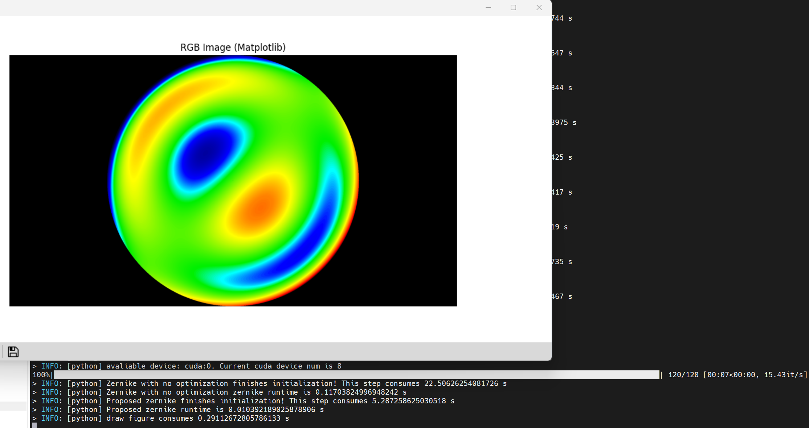

# ZernFDA
This is open-source zernike polynomials acceleration work implemented on CPU, GPU, and FPGA. This project implements our latest research achievements in FPGA-accelerated Zernike polynomials computation, with a related paper submitted to **TCAS-II** (Under Review). We provide complete implementations from CPU/GPU to FPGA hardware acceleration.

## Project Structure
```
.
├── FPGA/                  # FPGA Hardware Implementation
│   ├── bitstream/         # Pre-built bitstream files (*.bit)
│   ├── constraints/       # Timing & Physical Constraints
│
├── Ours/                  # CPU/GPU Reference Implementation
│   ├── Ours.py            # PyTorch-based design (baseline & proposed method)
│
├── fonts/                 # Font resources for visualization (.ttf)
│
├── evaluation/            # Performance Evaluation
│   ├── time/              # Time measurement data
│
├── ZERN/                  # Third-party implementation [1]https://github.com/AlvaroMenduina/ZERN
├── zernike/               # Third-party implementation [2]https://github.com/jacopoantonello/zernike
├── zernpax/               # Third-party implementation [3]https://github.com/PlasmaControl/ZERNIPAX
├── zernpy/                # Third-party implementation [4]https://github.com/sklykov/zernpy
│
└── LICENSE                # MIT License
```

## Access FPGA Implementation
Complete FPGA project requires to send request to helix@seu.edu.cn (include affiliation/research purpose)

## Quick Start

```
# Install dependencies
pip install -r requirements.txt

# Run CPU version to evaluate performance
python main_cpu.py

# Run GPU version to evaluate performance
python main_gpu.py

# FPGA Demo (Requires Vivado Tools)
1. We need to obtain a FPGA board such as XCKU060 FPGA same with this project
2. Program bitstream to KU060 FPGA
3. Connect HDMI display to visualize real-time Zernike computation patterns

```

## CPU/GPU Execution Result
Please follow this step, and we can achieve this result .

```
cd ./Ours

python Ours.py
```

## FPGA Deployment Result
We present .bit and .bin file to download XCKU060 FPGA. If we download .bin file to FPGA, the real-machine operation result is shown in this video. We need to wait about 40 second for flash loading bitstream to FPGA.

https://github.com/user-attachments/assets/b0402c2b-4bc8-44e4-b429-29771150c9e2

**Southeast University Heterogeneous Intelligence & Quantum Computing Laboratory** © 2024
